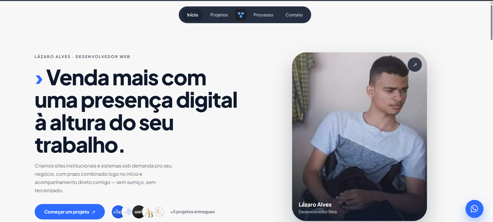

# Alves R

**Desenvolvimento de sites e sistemas sob demanda.**
Site institucional de Lázaro Alves (Alves R) — desenvolvedor web.

🔗 [www.lazaroalvesr.com](https://www.lazaroalvesr.com/)

<p align="center">
  
</p>

<p align="center">
  
  
  
  
</p>

## Sobre

Sem sumiço, sem terceirizado. Sites e sistemas sob demanda, projeto conduzido
diretamente por mim do primeiro contato à entrega, com prazo combinado logo
no início.

Este repositório é o código do meu próprio site — a vitrine que uso pra
mostrar os projetos que já entreguei e captar novos contatos pelo WhatsApp.

## Stack

- **Next.js 15** (App Router) + **React 19** + **TypeScript**
- **Tailwind CSS v4** — design tokens em `app/globals.css`
- **Lenis** — smooth scroll
- **next/image** — otimização e lazy loading de imagens
- SEO: metadata + JSON-LD (`app/layout.tsx`), `sitemap.ts`, `robots.ts`, `manifest.ts`

## Funcionalidades

- Header flutuante com scroll suave até cada seção, sem `#` sujando a URL
- Carrossel infinito de projetos com autoplay e navegação manual
- Seções com animação de entrada ao rolar a página (`Reveal`)
- Botão flutuante de WhatsApp
- Layout responsivo, do mobile ao desktop

## Estrutura

```
app/
  layout.tsx        fontes, metadata, JSON-LD, <html>/<body>
  page.tsx           composição das seções da home
  sitemap.ts | robots.ts | manifest.ts
  globals.css        design tokens (cores, tipografia) e reset

components/           uma seção por arquivo
  Navbar, Hero, Marquee, Projects, PracticeGrid,
  Process, Contact, Footer, WhatsAppFloat
  Photo.tsx           imagem com next/image (aceita placeholder sem src)
  Reveal.tsx          animação de entrada no scroll
  SmoothScroll.tsx    wrapper do Lenis

lib/
  data.ts             textos, projetos e links (edite aqui pra atualizar conteúdo)
  ui.ts               classes Tailwind reaproveitadas entre seções
```

## Conteúdo e imagens

Textos, projetos e o número do WhatsApp ficam centralizados em `lib/data.ts`.
Fotos e logos de clientes vão em `public/images/`.

## Cores

Definidas como tokens em `app/globals.css`:

| Variável         | Uso                       |
| ---------------- | ------------------------- |
| `--color-bg`      | fundo da página            |
| `--color-ink`     | texto principal            |
| `--color-accent`  | azul de destaque da marca  |
| `--color-surface` | fundo de cards/blocos      |

## Contato

- WhatsApp: via botão flutuante no site
- [Instagram](https://www.instagram.com/alvesrsites/)
- [LinkedIn](https://www.linkedin.com/in/l%C3%A1zaro-alves-r/)
